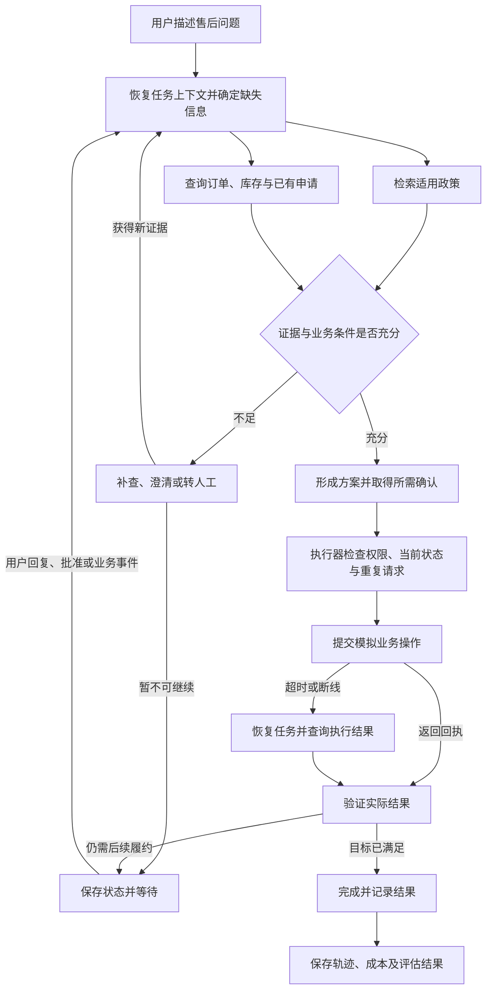
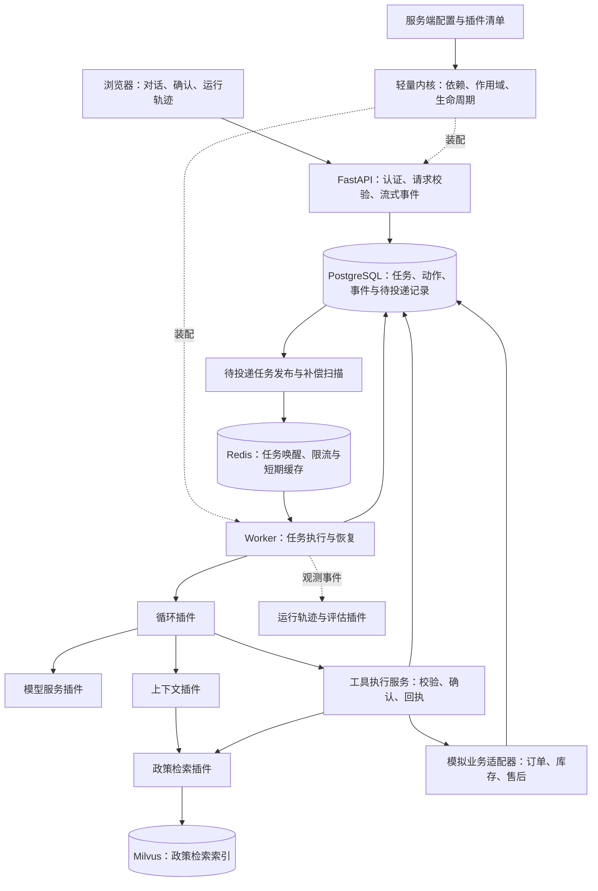

# 客服 Agent Harness 实现方案：逐模块讨论稿

> 历史归档：不作为当前实施依据。当前设计见 [项目入口](../../README.md)；本文保留旧讨论，技术栈与业务范围以当前分步文档为准。

版本：2026-09-09。目标：用于 Agent 开发/算法实习求职的个人项目。

**讨论状态：模块 1 的换货/补发主场景已获认可；本轮讨论模块 2「插件化架构与后端职责」。** 用户补充：已有 coding agent + Agent-RL 项目，RAG 用于补齐知识面，亮点不限于 RAG；希望使用 Redis、Milvus 等后端组件并能部署上线。以下模块 2 是建议，尚未定稿。后续模块经逐项讨论后再补入本文件。

原黑客松方案保留，不把其界面、比赛指标或人工插件限制直接带入新项目。

每个模块统一回答：问题场景 → 方案与替代方案 → 实现边界 → 如何验证 → 面试可以讲什么 → 参考来源及实际借鉴部分。实现完成之前，不填写虚构指标或简历成果。

“PR 图”的具体含义正在确认；当前仅提供明确标注的业务闭环图，不将其冒称为用户要求的 PR 图。

## 模块 1：项目定位与最小闭环

### 1.1 推荐定位

**一个具备政策检索、受控执行、状态恢复与可回放评估能力的售后客服 Agent Harness。**

暂名 `Aftercare Harness`。客服业务作为验证载体，主要技术产物是一个职责明确的运行框架，能够支撑模型持续处理同一服务任务。

它可以直接与模拟消费者对话，按权限查询和执行售后动作；只在需要审批、缺少证据或超出能力时引入人工。开发者界面用于查看依据、批准动作和检查运行轨迹，不再受限于比赛右侧插件。

推荐把第一条完整业务链定为：**订单商品破损后的换货/补发处理**。退款作为后续相邻扩展，先不把多种复杂资金规则塞入首个流程。

理由：换货需要同时理解用户、检索政策、读取订单、选择规格和执行操作；还会遇到缺货、重复申请、接口超时和人工接续。一个场景就能检验 Harness 的大部分核心责任。

与产品经理同事讨论后，保留以下取舍供本轮决定：

| 主场景候选 | 优点 | 代价与不足 |
|---|---|---|
| 退款进度核验与催办（产品经理建议） | 赛事已有补差待审核案例；接口少，容易做出等待、恢复与结果核验 | 核心通常是结构化状态查询，政策检索占比较小；若以 RAG 为算法亮点，需要另找充分的问题依据 |
| 破损商品换货/补发（本稿推荐） | 政策适用性与实时业务条件共同决定动作，能同时检验检索和执行 | 需要补充政策、库存及申请接口；必须收紧业务范围 |

推荐选择第二项，但首版仅覆盖**一个模拟商家、一个渠道、同 SKU 的质量问题换货/补发**。库存和履约时间由简单模拟接口提供；跨色号换货、差价结算、真实物流和支付暂不纳入。这里的取舍是增加少量可控业务复杂度，换取更充分的检索与执行交互问题，而不是继续扩大客服业务版图。

### 1.2 具体问题场景

以下为拟构建的测试任务，不是赛事原文或品牌政策。

> 用户：“上次买的粉底液泵头坏了，能换同色号吗？这周要用，别让我重新买。”

系统需要完成：

1. 从可信会话身份关联订单，判断用户指哪一笔；有歧义才追问。
2. 检索该渠道、该商品和当前时间适用的换货政策，区分一般退货与质量问题条款。
3. 查询订单状态、已存在的售后申请及同色号库存。这些是实时事实，不能用向量检索猜。
4. 必要材料缺失时，仅追问缺项；政策依据不足则明确待核验。
5. 给出可行处理方案。预计时间必须有履约服务返回的依据，不能迎合“这周要用”随意承诺。
6. 用户确认方案后，在授权范围内提交模拟换货申请；需要员工批准的例外进入等待状态。
7. 返回申请 ID 和实际处理状态。随后可查进度；异步结果到达时更新同一个任务。

**终态由任务目标定义。** 若用户只要求提交申请，“提交成功并取得回执”可算本次目标完成；若目标包括收到替换商品，提交只是中间状态，需要继续跟踪。聊天停止、模型说“办好了”都不是统一的成功标准。

### 1.3 两个必须演示的失败分支

**分支 A：知识依据不足或冲突。** 检索到了旧政策，或者一般条款与渠道例外不一致。系统应识别适用范围和证据缺口，选择补查、澄清或转人工，而不是生成一个看似合理的退款/换货承诺。

**分支 B：业务已执行，客户端却超时。** 后端已创建换货单，但调用方没有收到响应；之后进程重启，用户再次说“那就换吧”。系统应恢复任务、查询同一请求的回执，避免再创建一张单。

这两个分支分别检验证据判断和工程可靠性；RAG 是完整系统中的知识能力，不再预设为项目的主要创新点。

### 1.4 业务闭环图



这张图规定产品行为，不规定把每个方框实现成一个 Agent。模型可选择必要工具及追问方式；身份、授权、状态迁移与成功判定必须由程序执行。

### 1.5 什么才算 Harness 核心完整

本节只确定必须拥有的责任，具体接口、库和存储方案留到相应模块讨论。

| 核心责任 | 在这个场景中的用途 | 验收证据 |
|---|---|---|
| 模型调用与工具循环 | 根据新证据选择查询、追问和动作 | 一个任务能完成多轮调用，并按预算结束 |
| 类型化工具边界 | 区分查订单、检索政策与创建申请 | 非法参数被拒绝，工具错误可被下一步处理 |
| 上下文与任务状态 | 保存用户选择、已知事实和等待原因 | 等待批准或进程重启后能继续 |
| 知识检索与证据 | 用有效政策支撑方案 | 能显示版本、来源及不适用原因 |
| 执行约束 | 把用户确认、员工批准和业务规则分开 | 越权与重复请求被拦截 |
| 错误恢复 | 应对超时、取消和部分成功 | 不重复执行外部副作用，不伪报成功 |
| 结果校验 | 判断用户目标是否真正满足 | 检查后端记录与实际回执 |
| 可观测性与评估 | 解释失败发生在哪一步 | 有可关联的运行轨迹、耗时、token 和逐例结果 |

长期个性化记忆、复杂自主规划和多 Agent 协作不是“完整”的前提；先保证同一任务的短期上下文、等待恢复及结果闭环可靠。

### 1.6 RAG 在这里为什么必要

政策文本需要语义理解，并可能按渠道、产品和时间变化；把全部政策写进系统提示词，难以维护版本和适用范围。因此，**RAG 提供可引用的政策证据，业务工具提供当前事实，规则代码负责确定性限制**。

Embedding、重排器和具体检索流程留到 RAG 模块讨论。根据用户补充，模块 2 先讨论采用 Milvus 的理由和代价，不提前承诺 GraphRAG。

此前提出的“证据不足时追加检索”降为可选实验，不作为项目主线；是否值得做，要在基础 RAG 完成后依据错误分析决定。

### 1.7 数据方向：先确认有可执行环境，再扩充知识

赛事数据有 138 段会话和 80 张工单，适合中文用户表达、售后场景和时点异常案例；没有完整政策库、可靠跨会话身份和可执行的业务环境，不能单独支撑该项目。

已找到一个优先研究的公开来源：[Sierra Research 的 τ-bench 仓库](https://github.com/sierra-research/tau2-bench)。它按领域提供 policy、tools 和 tasks，含 retail，适合研究如何建立可执行客服任务和评估标准。其当前 README 已升级介绍 τ³-bench，还增加了知识检索领域，不能把主分支笼统当作原始 τ² 版本。

本项目拟分别使用：零售任务验证工具执行；后续筛选的公开知识任务验证 RAG。不同领域数据不混充美妆业务事实。仓库根许可证为 MIT；正式选取数据时还要检查具体数据来源和附加条款，并固定版本、划分与转换记录。[仓库许可证](https://github.com/sierra-research/tau2-bench/blob/main/LICENSE)

这只是确认数据路线可行，本轮未下载或改造该数据集。具体数据规模、中文转换、去重、防泄漏和其他来源，在数据模块单独讨论。

### 1.8 控制代码规模的设计原则

建议自写核心运行时、业务适配、检索接入与演示界面合计控制在 **4,000～7,000 行左右**；测试和评估另计，初步预算 1,500～3,000 行。不计依赖、锁文件、原始数据和引用项目源码。这是范围约束，不是为了凑行数删检查或压缩可读性。

- 一个部署单元起步，不先拆微服务。
- 每项跨系统职责只定义一个清晰接口，先实现一个真实适配器，避免为假想需求建十层抽象。
- 运行时不依赖美妆字段；换货规则留在业务适配层。
- 检索器不决定是否退款，模型适配器不管理订单，前端不直接改任务状态。
- 优先使用成熟库处理协议和底层存储；自己的代码集中在业务边界、恢复语义和可复现实验。

是否以 LangGraph 承载状态机，还是实现较小的自有循环，需要在运行时模块比较后决定。不会为了突出“自研”而重复实现所有底层设施，也不会把调用框架入口当作全部技术贡献。

### 1.9 本轮参考了什么

| 参考 | 已核查材料 | 借鉴点 | 暂不照搬的部分 |
|---|---|---|---|
| [commerce-agents](https://github.com/anthropics/commerce-agents) | 上一轮已阅读的固定提交源码 | 业务 Backend、来源校验、草案与执行分离、服务端补齐事实 | Claude 专属运行时及购物导购范围 |
| [LangGraph](https://github.com/langchain-ai/langgraph) | 官方 README、[持久化文档](https://docs.langchain.com/oss/python/langgraph/persistence) | 把任务暂停、恢复和状态保存作为运行系统责任 | 不先引入整套平台或把依赖框架叫作自研成果 |
| [τ-bench](https://github.com/sierra-research/tau2-bench) | README、[任务评估说明](https://github.com/sierra-research/tau2-bench/blob/main/docs/evaluation.md)、许可证 | 把政策、工具、任务与动作正确性放在一起验证 | 不混用版本和修改后的任务分数，不引入语音全套依赖 |
| [RAG-Critic，ACL 2025 主会长文](https://aclanthology.org/2025.acl-long.179/) | 正文 §3.3、图 3、算法 1；[官方代码](https://github.com/RUC-NLPIR/RAG-Critic) | 错误类型与修正动作对应，而非笼统要求模型重新思考 | 不直接复现其 Critic 训练和模型生成 Python 执行方案 |

RAG-Critic 的论文方案包含错误模型训练和规划执行；我们的候选方案仅借鉴其“先识别错误再选择修正动作”的思想，采用与否还要看下一模块设计与实验。不能把提示词复核称作完整复现论文。ACL 的 A 类归属可核对 [CCF 官方 ACL 条目](https://www.ccf.org.cn/Academic_Evaluation/AI/zgjsjxhtjgjxshy/al/2017-04-25/592027.shtml)。本轮不把 τ-bench 或其他尚未核实发表类别的材料冒称为 CCF-A 论文。

“近两年”优先按 2024 年 9 月至 2026 年 9 月的成果或版本选择；成熟项目可参考其近两年的演进，不声称这些项目都在近两年才诞生。

### 1.10 面试能够讨论的三个问题

1. **为什么 RAG 检索政策，而订单用工具查？** 二者在一致性、权限、时效和查询语义上不同，混在一个向量库里会丢失业务约束。
2. **为什么审批按钮不等于完整的人在回路？** 还要保存等待状态、明确批准的是哪份方案，并在恢复后核对参数和当前业务条件。
3. **怎样证明“处理成功”？** 以目标对应的业务结果验证，分别记录回答质量、政策遵守、动作正确性、恢复成功率和成本。

这些问题最终都需要代码、失败案例和实验结果支撑；设计文档本身不是已经做出的简历成果。

### 1.11 本轮讨论结论

用户认可**换货/补发的完整执行链**作为项目主线。项目定位调整为：以可部署的业务 Agent 工程为主体，用 RAG 补齐知识检索能力，进一步探索插件化、可靠执行和其他有问题依据的技术亮点。

本轮进入模块 2；运行循环、RAG、数据、评估和部署的详细实现仍分别讨论。

## 模块 2：插件化架构与后端职责（待讨论）

### 2.1 推荐结论及与已有项目的区别

**推荐做一个以插件装配能力、以持久化任务管理执行的售后 Agent 服务。** 使用 Python 实现轻量 Harness 与后端，首版接入 PostgreSQL、Redis、Milvus，并通过容器部署。

已有项目展示 coding agent 和 Agent-RL，本项目重点补齐三个方面：可扩展的运行系统设计、具有业务副作用的后端可靠性、可部署且有依据的知识检索。创新可以体现在可靠且可测的组合设计上，无须再做一轮模型训练来证明技术深度。

与产品经理同事讨论后，建议两个主要展示点：

1. **能力装配与执行权限保持一致。** 同一核心通过配置形成“只读接待”和“受控执行”两种服务；依赖不齐不能启用执行，模型看见工具也不代表有权调用。
2. **插件参与的任务恢复与故障实验。** 在模拟业务已成功但响应丢失的情况下，恢复任务、查回执且不重复创建申请；用故障注入和运行记录解释为什么能做到。

RAG 需要具备检索、适用范围过滤、引用和知识更新能力，作为真实能力交付。Redis 和 Milvus 也必须参与实际请求链路，并有故障处理，不能只出现在技术栈列表里。

### 2.2 DeepSeek Harness 的理念如何迁移

核查对象是 [DeepSeek 官方 deepseek-harness](https://github.com/deepseek-ai/deepseek-harness)，不是第三方同名项目。官方将它标为开发者预览，提醒接口可能发生兼容性变化。[官方 README](https://github.com/deepseek-ai/deepseek-harness/blob/master/README.md)

架构研究同事进一步核对了源码，本轮参考固定为提交 [`5dda764ed3aa172535a7967b06ff95d9cbfe536a`](https://github.com/deepseek-ai/deepseek-harness/commit/5dda764ed3aa172535a7967b06ff95d9cbfe536a)，对应 2026-09-08 的 `dsh@0.1.5-alpha.1`。下方 master 文档链接方便阅读；复核实现时以本节固定链接为准。

其核心思想是：Cordis 管理插件的装配与生命周期，模型、工具、会话和循环等能力由插件提供。插件通过服务与事件协作。[官方介绍](https://www.deepseek.com/harness/)

我们借鉴**能力接口、实现插件、配置装配**三者分离；不以复刻 Cordis 的所有动态特性为目标。具体取舍如下：

| 路线 | 能获得什么 | 代价 | 本项目建议 |
|---|---|---|---|
| 直接基于 DeepSeek Harness 开发插件 | 复用已有插件生态及运行能力 | 核心以 Node/TypeScript 生态为主，需要理解较大的宿主及快速变化的接口 | 如果目标是做 DSH 生态插件可选；当前先参考其设计 |
| Python 后端 + 小型插件内核 | 易与模型、RAG、评估代码放在一个工程中；自己的运行边界更容易解释 | 需要自己完成有限的依赖校验与生命周期管理 | **推荐**，只实现项目确实需要的部分 |
| Python + LangGraph 作为循环实现 | 可复用其持久化与暂停恢复能力 | 必须理清框架 checkpoint 和业务执行记录谁负责什么 | 保留为运行时模块的比较项，不再额外叠一套竞争的状态机 |

语言选择是为减少工程边界，不表示 Python 天然比 TypeScript 更适合插件。DSH 也提供 Python SDK；[官方架构文档](https://github.com/deepseek-ai/deepseek-harness/blob/master/docs/architecture.md)说明其默认通过启动 DSH SDK profile 连接运行时，不能将其误解为整套核心已经用 Python 实现。

### 2.3 “一切皆插件”的范围

**插件负责提供能力；宿主负责确保这些能力按约定装配和运行。** 插件可以只是本仓库内一个 Python 模块，不要求独立发包、单独进程或单独服务。

| 可装配能力 | 面临的问题 | 预期插件边界 |
|---|---|---|
| 模型调用 | 模型供应商和响应格式可能更换 | 统一模型请求、流式输出、工具调用与用量结构 |
| Agent 循环 | 对话、工具调用、等待、结束需要统一驱动 | 接收任务与事件，调用服务接口；不写死商品字段 |
| 上下文构建 | 长轨迹和大量工具挤占输入预算 | 组装当前事实、相关证据和允许使用的工具 |
| 工具与业务规则 | 查询和写操作的权限、错误语义不同 | 类型化工具、业务校验、计划确认与结果核验 |
| 知识检索 | 政策与订单事实具有不同的数据访问方式 | 返回带版本及来源的证据，不直接批准换货 |
| 状态与调度 | 请求结束后仍可能需要等待和恢复 | 任务存取与唤醒接口；具体对接 PostgreSQL、Redis |
| 观测与实验 | 失败难定位，复现会触发真实写操作 | 事件订阅、记录回放、仅测试环境可用的故障适配器 |

首版不把前端组件、每条提示词和每个辅助函数都做成插件。界面是 API 的客户端；提示词和业务参数先作为带版本的资源。只有出现清楚的替换或生命周期需求才提升为独立插件。

### 2.4 内核最小实现思路

内核限定四项责任，初步预算约 400～700 行自写实现，作为模块 1 总预算的一部分：

1. **校验声明。** 每个插件声明 `id / version / api_version / provides / requires`；配置来自服务端允许列表，不接收聊天内容指定的任意导入路径。
2. **解析依赖。** 根据服务接口建立依赖图，拒绝缺项、循环依赖及未显式选择的重复实现；按依赖顺序启动。
3. **提供作用域。** 区分应用资源与单次运行上下文。连接池属于应用；用户身份、任务 ID、授权和预算属于当前运行。
4. **管理生命周期。** 启动失败按逆序清理已建立的连接与订阅；关闭先停止接新任务，再结束工作并释放资源。卸载插件不删除持久任务，更不能撤销已发生的业务操作。

接口优先使用 Python `Protocol` 与数据类，输入输出边界使用 Pydantic 校验。生命周期可借助标准库 `AsyncExitStack`，不先引入通用插件管理平台。

**关键区分：服务调用与事件通知承担不同责任。** 检索、授权和执行是需要明确返回值的服务调用；日志和统计是观察事件。具有否决作用的校验必须显式等待，不能发一条异步事件就假定已经通过。这样避免代码变成难以追踪的全局事件网。

这里值得具体借鉴 DSH 的 **monotonic guard**：其工具源码将普通 `pre-execute` 扩展与后续强制 guard 分开，guard 只返回拒绝或不干预，其他扩展不能把一次拒绝改成允许。[`ToolGuard` 定义](https://github.com/deepseek-ai/deepseek-harness/blob/5dda764ed3aa172535a7967b06ff95d9cbfe536a/packages/core/tools/src/index.ts#L653)、[`prepareExecution` 执行顺序](https://github.com/deepseek-ai/deepseek-harness/blob/5dda764ed3aa172535a7967b06ff95d9cbfe536a/packages/core/tools/src/index.ts#L1372)

迁移到售后场景：**策略实现可以替换，执行检查这一步必须保留。** 先验证必须使用的检查器齐备且来自可信配置，再按明确顺序检查身份、方案确认、当前业务条件和重复动作。任何一项拒绝或必要检查异常都停止提交；“所有 guard 未拒绝”也不能代替其前置的明确授权。具体订单规则是我们自己的实现，不声称 DSH 已替我们实现了售后事务。

示意配置，仅表达边界，尚非已实现 API：

```yaml
profile: aftercare-execute
services:
  model: model-compatible
  loop: durable-tool-loop
  context: task-context
  knowledge: milvus-policy
  state: postgres-state
  scheduler: redis-streams
  tools: aftercare-tools
  authorization: confirmed-action
  execution: receipted-action
observers:
  - run-trace
```

版本与配置摘要由装配器写入运行清单。`aftercare-readonly` 不装配写操作入口；执行配置必须通过依赖及授权能力检查。这里只保留一份正式实现和必要的测试替身，不为了体现可插拔而开发三个模型 SDK、三个数据库后端。

### 2.5 插件化必须守住的运行约定

这些约定用于保证后续模块能闭环，本轮先定边界，下一轮再设计数据结构和状态迁移。

- **扩展能力不等于扩展权限。** 工具可见集合取配置、当前任务状态与服务端授权的交集；调用时再次校验。只在提示词里写“禁止操作”不构成执行限制。
- **确认绑定具体动作。** 确认记录应关联用户、订单、参数及方案版本。模型改了 SKU 或数量，不能沿用旧确认。
- **首版只在启动时装配。** 暂不做运行中热替换、插件市场或模型自行安装插件。原生 DSH 不同 profile 对热重载已有区别；本项目选择更窄的生命周期范围。[DSH Profiles and bundles](https://github.com/deepseek-ai/deepseek-harness/blob/master/docs/architecture.md#profiles-and-bundles)
- **恢复时检查运行版本。** 保存插件清单、配置摘要和状态格式版本。旧任务遇到不兼容的新代码时明确暂停迁移，不静默使用新实现接管。首版部署采用排空活动任务后升级，异常遗留任务显式处置。
- **固定代码版本不等于冻结业务事实。** 恢复执行前仍检查当前权限、库存和适用政策；原依据失效则重新形成方案，必要时重新确认。回放使用历史证据，线上恢复使用应当适用的最新事实。
- **插件是受信代码。** 进程内服务接口有助于约束程序结构，但不能隔离恶意插件；首版仅加载随项目发布并审查的插件。第三方不可信代码的进程隔离留作未来需求。

### 2.6 总体架构图

本图是组件与数据职责图；用户最初所说“PR 图”的具体含义尚未确认。



API 和 Worker 使用同一代码仓库与镜像、不同启动入口；这是一个模块化后端的两类进程。图中发布器与扫描器先放在 Worker 中，不额外拆服务。模拟业务可以共享 PostgreSQL 实例，但使用独立表与接口，方便检验业务端与 Agent 状态不一致的情况。

### 2.7 Redis、Milvus、PostgreSQL 各自为什么存在

| 组件 | 本项目真实职责 | 不应交给它的责任 | 异常时预期行为 |
|---|---|---|---|
| PostgreSQL | 任务与审批状态、动作幂等记录、已提交事件、待投递任务；模拟业务记录 | 大段知识相似度检索的默认入口 | 关键状态无法持久化时暂停写操作 |
| Redis | API 与 Worker 之间的任务唤醒、待处理消息接管；模型请求限流；带版本键的短期检索缓存 | 唯一任务真相、永久审批记录，或仅凭一个锁保证不重复下单 | 任务保留在数据库待处理；恢复后补发通知，缓存丢失可重建 |
| Milvus | 政策文本的稠密／稀疏检索、适用范围过滤；可重建的知识索引 | 订单余额、实时库存、售后执行记录 | 明确知识服务不可用；可继续查订单，不能据此宣称政策允许执行 |

**Redis 选 Streams 的原因：** 短任务需要交给 Worker，且 Worker 崩溃后需要接管未完成消息。Redis 官方提供消费者组及未确认消息接管机制。[XREADGROUP](https://redis.io/docs/latest/commands/xreadgroup/)、[XAUTOCLAIM](https://redis.io/docs/latest/commands/xautoclaim/)

本项目按可能重复投递设计。数据库提交任务与待投递记录放在同一事务中，再发出唤醒通知；恢复扫描处理未终结任务，补回消息丢失或被清理后留下的工作。该思路参考 [Transactional Outbox](https://docs.aws.amazon.com/prescriptive-guidance/latest/cloud-design-patterns/transactional-outbox.html)。不把 Redis 的队列去重或分布式锁等同于外部业务“恰好执行一次”；最终还需要动作 ID、业务端幂等和回执核验。

首版不同时引入 Kafka、RabbitMQ 和 Celery。选择 Redis 是因为本项目还需要限流、缓存，并且只实现有界的唤醒队列；若后续出现复杂排程再评估任务框架。具体接管时机、重试次数和并发控制在运行时模块讨论。

### 2.8 为什么选 Milvus，而不是其他向量数据库

**按现有数据规模，pgvector 完全值得优先考虑。推荐 Milvus 的理由包含明确的学习目标，而不是宣称小数据已经需要分布式向量数据库。**

我们需要展示：索引建立和更新、语义与词项检索组合、渠道／版本过滤、独立检索服务的接入与故障处理。Milvus 可以承担这些工作；其 BM25 与稠密检索能力让首版不必另外引入全文检索集群。[Milvus 全文检索](https://milvus.io/docs/full-text-search.md)、[混合检索](https://milvus.io/docs/multi-vector-search.md)

| 候选 | 为什么适合 | 本轮取舍 |
|---|---|---|
| **Milvus** | 独立向量检索服务，支持稠密／稀疏检索及标量过滤，可练习完整索引生命周期 | 推荐为主实现；接受额外资源和运维成本，首版用 Standalone |
| **PostgreSQL + pgvector** | 已有事务库，可把向量与关系数据放在一起，减少一个服务 | 如果只求最省事上线，会优先考虑它；当前因用户希望补齐独立检索中间件经验而选择 Milvus |
| **Qdrant** | 同样支持混合检索，官方提供单容器快速启动方式 | 是有竞争力的替代项，不能用“没有混合检索”排除它；当前缺少测量证据证明 Milvus 一定更快或更准 |

比较依据：[pgvector 官方 README](https://github.com/pgvector/pgvector)、[Qdrant 混合查询](https://qdrant.tech/documentation/search/hybrid-queries/)、[Qdrant 快速启动](https://qdrant.tech/documentation/quick-start/)。以上是针对本项目的选择，没有做数据库性能排名。

不为证明选择正确而给所有库各写一套适配器。首版实现 Milvus 和一个轻量测试替身即可。中文分词、Embedding、重排、检索质量与时延需要在数据确定后验证；数据库品牌本身不保证回答更准。

### 2.9 能否轻量部署上线

**代码轻量与基础设施轻量需要分别衡量。** 推荐 Python + FastAPI + PostgreSQL + Redis + Milvus，前端采用简洁的 TypeScript 页面；ORM、前端框架和模型版本在对应模块确定。首版不引入 Kubernetes、服务网格或自托管大模型集群。

部署建议采用一台 Linux 服务器的 Docker Compose，API 与 Worker 共用镜像，模型通过外部 API 接入。浏览器通过 HTTPS 访问，数据库留在内部网络，演示账号只访问模拟订单；应具备健康检查、数据持久卷、备份恢复及请求预算。这是部署目标，本轮尚未购买资源或创建线上服务。

Milvus Standalone 的官方 Compose 方案还包含 etcd 和 MinIO，不能把它算成完全没有附属服务的一个进程。[官方部署文档](https://milvus.io/docs/install_standalone-docker-compose.md)

当前官方硬件页对 Standalone 列出 8 GB 内存要求、16 GB 推荐值，CPU 推荐至少 4 核；这些是 Milvus 的参考，并非整个项目的压测结果。[官方资源要求](https://milvus.io/docs/prerequisite-docker.md)

因此，不承诺整个技术栈能舒适跑在 2 核 2 GB 的便宜主机上。初步以 **4 核 16 GB 或更高**作为小规模全栈试部署候选，再依据实测调整；这不是容量或并发保证。预算不足时可将 Milvus 放到托管服务，或重新讨论 pgvector 的精简方案，不会把只使用本地嵌入式索引包装成完成了 Milvus 服务部署。

Windows 开发环境通过 WSL 2 / Docker 使用 Linux 容器。正式实现时固定服务镜像、SDK 与配置版本；本轮不根据文档中的 `latest` 直接锁定依赖。

### 2.10 新技术如何体现学习能力

这个模块的近期参考是 DeepSeek Harness 的插件架构。自己的贡献应是将其思想落实到售后任务的授权、持久化和可验证故障恢复。插件、消息队列和 Outbox 各有既有来源，应表述为工程设计与实现成果，不声称原创发明。

另外保留一个有实际动机的后续方向：**根据任务状态按需提供上下文和工具**。尚未确认订单时，只给识别与查询能力；已具备方案后才提供当前可用的动作。这样既能研究 token 成本，也能观察误调用率。它属于上下文模块候选，必须与完整工具集基线比较，当前不扩展成新的训练项目。

本轮不再把 RAG-Critic 设为必做项。后续需要论文支撑时，逐项核查发表场合、借鉴机制和实验设计；不会为了凑 CCF-A 引用，把预印本或插件工程文档称作顶会论文。

本模块可精确说明的开源借鉴位置：

| 固定版本资料 | 阅读重点 | 本项目借鉴与边界 |
|---|---|---|
| [DSH Cordis Primer](https://github.com/deepseek-ai/deepseek-harness/blob/5dda764ed3aa172535a7967b06ff95d9cbfe536a/docs/cordis-primer.md) | 服务、依赖注入、注册清理与事件语义 | 用小型 Python 接口实现有限装配，不复制全部 Cordis 功能 |
| [DSH Architecture](https://github.com/deepseek-ai/deepseek-harness/blob/5dda764ed3aa172535a7967b06ff95d9cbfe536a/docs/architecture.md) | Core packages、Events、Session log | 循环／工具／日志分工；持久事实与进程内通知区分；不承诺单靠日志实现业务一致性 |
| [DSH Tools 源码](https://github.com/deepseek-ai/deepseek-harness/blob/5dda764ed3aa172535a7967b06ff95d9cbfe536a/packages/core/tools/src/index.ts) | `ToolGuard`、`guard()`、`prepareExecution()` | 借鉴不可被后续扩展推翻的拒绝语义；新增售后授权与幂等检查 |
| [DSH SAFETY](https://github.com/deepseek-ai/deepseek-harness/blob/5dda764ed3aa172535a7967b06ff95d9cbfe536a/SAFETY.md) | 插件代码与宿主权限边界 | 进程内插件只接受受信代码，不把依赖注入宣传成安全隔离 |

这些借鉴落实为可测的工程行为；不以依赖项目的总代码量、功能列表或基准成绩作为自己的成果。

### 2.11 如何证明插件化有价值

| 演示／检查 | 预期可观察结果 |
|---|---|
| 用只读配置处理同一换货任务 | 可以查证据和形成方案，不能调用写操作；服务端也拒绝伪造的写请求 |
| 执行配置缺少授权服务 | 启动校验明确报出缺失依赖，不进入可接单状态 |
| 正常执行配置处理任务 | 经确认后创建一张售后单，返回可核验的申请 ID |
| 测试配置注入“创建成功后丢失响应”，然后重启 Worker | 恢复后查询已有回执，业务表中仍只有一张申请 |
| 插件升级导致旧状态格式不兼容 | 明确暂停并提示版本问题，不悄悄执行旧确认对应的动作 |
| 回放已记录轨迹 | 使用已记录的模型输出和工具结果检查状态变化，不访问有副作用的线上工具 |

回放、恢复和重新运行必须区分：回放消费历史记录；恢复处理未完成的真实任务；重新调用模型属于一次新实验，可能得到不同输出。故障注入插件只允许在测试或隔离的演示部署中启用。

以上均为验收目标，尚未实现或测量。插件版本固定、服务资源依赖及后台工作会增加少量代码；总量仍以模块 1 的预算为约束，优先删掉非必要展示功能。

### 2.12 本轮待讨论

推荐采用：**Python 轻量插件内核，启动时装配；插件能力与执行权限一致、任务故障恢复作为主要展示点；RAG + Milvus 提供知识能力，PostgreSQL + Redis 支撑后台任务。**

本轮希望先讨论“自己实现有限插件机制，参考 DSH”这一架构取舍，及两个展示点是否符合求职定位。确定后再进入运行时与执行闭环模块，详细设计模型循环、任务状态、工具契约、授权和恢复；不提前生成剩余模块的完整方案。
