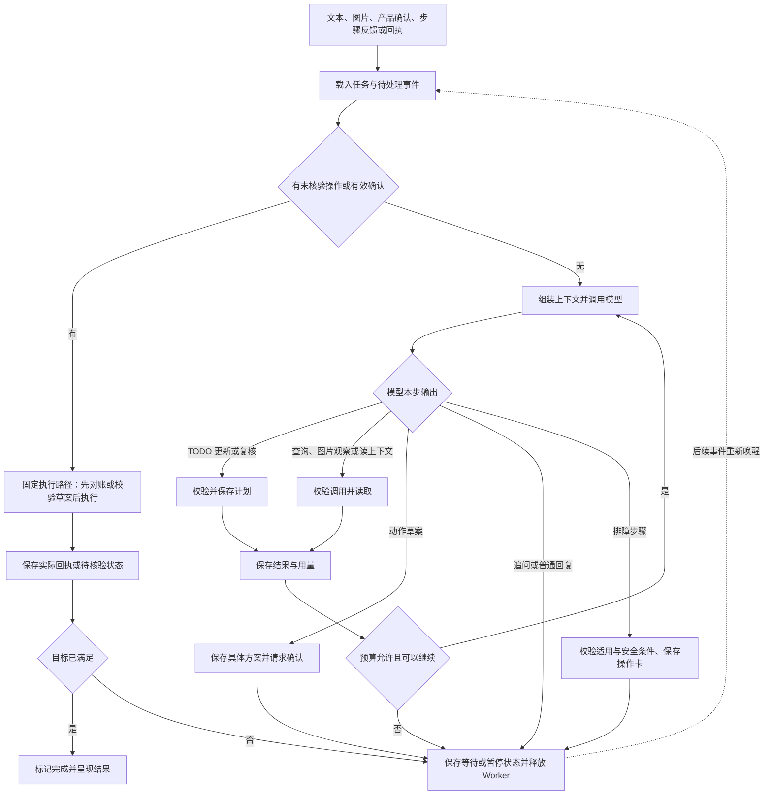

# 第二步：Agent 主逻辑与运行时

**状态：已按安克全产品售后场景修订（2026-09-12）。** 保留自写有界循环、强制 TODO、持久恢复与受控写入；加入产品确认、图片观察及排障反馈。工具契约见 [第三步](第三步-工具与Skill.md)。功能测试与效果评测代码不计入产品代码预算。

## 1. 推荐：事件唤醒任务，任务内运行有界工具循环

一次售后求助可能跨越排障、补凭证和人工接续，持续几天；每次处理通常只有几步。全产品共享同一循环，用持久状态跨越等待，用产品身份和适用知识约束当前决策，等待时释放 Worker。

| 概念 | 本项目中的含义 |
|---|---|
| Task（任务） | 一次明确的售后目标，跨对话、确认和业务事件存在 |
| Turn（一轮） | 一次唤醒后的连续处理，到回复、等待、暂停或完成时结束 |
| Step（决策步） | 一次模型请求及其工具结果；网络重试是同一步的 attempt，仍计成本 |

**本轮结束不等于任务完成。** 模型停止调用工具只结束这一轮；完成任务需要业务结果满足目标。确认事件可以直接推进执行，因此一轮也可以没有模型调用。这是本项目的术语约定，不要求与每个参考项目的命名完全相同。

## 2. 一轮具体怎样运行

入口可收敛为 `run_turn(task_id)`，模型、上下文、工具执行与存储通过插件接口提供：

1. **恢复与认领。** 读取待处理事件和任务版本。同任务仅一个执行者；若发现未核验的写操作，先查回执再决定后续，不能重新从用户原话启动。
2. **处理确定性事件。** 产品确认绑定候选与任务版本，操作反馈绑定步骤实例；过期卡片不推进当前状态。升级确认绑定草案版本，由程序检查后执行；回执更新动作状态。文本／图片输入进入模型循环。
3. **检查计划并构建上下文。** 保留目标、产品确认状态、TODO、当前步骤与反馈、所需图片及证据。无计划、目标／产品确认变化，或累计 3 个模型决策步没有成功调用 TODO 时，只允许 `todo`；成功后恢复普通工具。维持调用／结果配对，长内容按第五步外置读取。
4. **调用模型并接收完整决策。** 工具参数完整且通过校验后执行，截断调用不执行。普通说明可流式展示；涉及物理操作的步骤由 `present_troubleshooting_step` 检查后渲染，不直接流式发布模型自由生成的操作指令。
5. **执行并反馈。** 查询／图片观察返回证据后继续；呈现一步排障后等待用户操作反馈；生成升级草案后等待确认。追问结束本轮，普通解释不代表任务结束。模型不能自填“用户已操作”“已批准”或“已恢复”。
6. **提交进度。** 保存步骤、反馈来源、等待原因和用量，原子检查新输入。程序依据绑定当前步骤的恢复反馈或核验结果判定完成；道谢、静默和工单受理均不能替代故障解决证据。

首版工具按顺序执行，避免同一模型响应中多个调用争用状态。进入等待后，剩余调用记为未执行并补齐对应结果。独立只读查询的并行化留到有时延证据时再加；执行结果可由固定回执卡展示，必要时再调用模型解释。

## 3. 三种工具结果，三种处理方式

| 结果 | 例子 | 循环处理 |
|---|---|---|
| 有效观察／业务阻断 | 产品有歧义、图片不清、凭证不足、用户无法执行步骤 | 反馈结构化缺项，澄清或升级；不当作系统故障重试 |
| 确定失败 | 参数非法；只读接口暂时不可用 | 参数问题让模型修正；临时网络失败可有限重试，均计入预算 |
| 执行结果未知 | 写接口超时、提交后进程崩溃 | 暂停新写入，按同一操作号对账；禁止盲目重发 |

首版拟设每轮最多 **8 个模型决策步、16 次工具调用**，临时网络错误最多额外重试一次；调用超时、token 额度和任务累计预算可配置。它们是起始配置，需通过评测调整。额度不足进入暂停并说明原因，重复通知不能重置预算。

TODO 强制请求在模型适配器支持时使用指定工具的 `tool_choice`；否则只暴露 TODO 并在执行器拒绝其他输出，不能降为一句提示词提醒。成功核对才清零计数；失败最多纠正一次，仍失败或预算耗尽则暂停。所有规划调用都计入上述预算；不为检查计划唤醒等待任务，也不阻塞固定确认执行与未决操作对账。详细契约见第三步。

## 4. 等待和恢复靠什么

仍保存三类信息：**任务快照**（目标、产品与确认版本、当前排障步骤、TODO、状态与预算）、**事件／步骤记录**（原输入、图片引用、观察、用户反馈与依据）、**动作记录**（升级草案、确认、操作号与回执）。PostgreSQL 是依据，Redis 负责唤醒；模型请求不占用长期数据库事务。

| 情况 | 明确的恢复规则 |
|---|---|
| 等待产品确认／补图／操作反馈／凭证／人工处理 | 保存 `WAITING` 与原因和关联版本，释放 Worker；相关事件到达后恢复，不能重新要求已完成的操作 |
| 写操作开始前 | 先保存执行意图与操作号，再请求业务端；新工具调用 ID 不代表新的业务动作 |
| 写入后丢失回执 | 恢复后按操作号核验；查不到且业务端不能可靠去重时继续暂停，不能保证“恰好一次” |
| 用户改口或确认了另一产品 | 下一安全边界使受影响步骤、知识与草案失效；解除旧购买记录／质保结论的当前绑定，重新核对关联；保留历史归属，已发出的操作先对账 |
| 浏览器断开／用户点击停止 | 断开只停止订阅；显式停止阻止后续步骤。已发出的写操作仍需核验，停止模型不等于撤销业务 |

运行状态可限定为 `READY / RUNNING / WAITING / PAUSED / COMPLETED / CANCELLED`，原因单独记录。结果未知属于动作状态；有未核验动作时不能标记任务完成或已取消。

每个排障步骤保存 `step_id / instance_id / product_version / evidence_refs / user_feedback`。无变化时基于新证据选下一步或升级，重复同一步须有条件变化或复测依据。工单受理后保留 `WAITING(human_service)` 与“未解决、已升级”；人工处理结果或用户明确恢复反馈才能推进解决状态。

同任务串行依靠任务拥有者／版本校验，首版一个 Worker 进程、不同任务可并发。事件先持久化再通知；进入等待与确认没有新输入要做原子校验，恢复扫描补回丢失的通知。将来增加多个 Worker 时仍需防止旧执行者覆盖状态，Redis 锁本身不能保证业务不重复。

## 5. 从开源项目借鉴什么，为什么这样取舍

| 项目与核查位置 | 借鉴部分 | 在本项目中的取舍 |
|---|---|---|
| [Pi：agent-loop.ts][pi]，`runLoop`、`streamAssistantResponse` | 小型模型／工具循环，调用模型前转换上下文，在安全边界接收新输入 | 保留简洁循环与上下文接口；跨进程恢复由本项目补充，不能把 Pi 的内存循环直接叫持久工作流 |
| [DSH：Architecture][dsh]，Turn flow、Events | step／turn 分工，inbox 输入，持久事件与进程内事件分离 | 确认和业务回执成为唤醒事件；循环作为插件，不增加多个控制 Agent |
| [Commerce Agents：orchestrator.py][commerce]，`stream_turn`；[turn.py][turn] | 有界迭代、工具结果配对、用量累计，截断与异常的善后 | 保留这些约束；首版等待完整模型响应再执行工具，不复制其流式提前派发和部分 UI 渲染复杂度 |
| [LangGraph：持久化][lg-state]与[Interrupts][lg-interrupt] | 保存进度后暂停、按同一任务恢复；中断恢复可能重跑节点，副作用需要单独处理 | 借鉴恢复语义；不将 checkpoint 当作业务接口幂等保证 |

**继续自写这一个有界循环。** 查询、排障反馈和升级均可映射成工具结果或等待事件，业务动作记录仍需自己管理。产品差异优先进入资料与规则，不复制运行时。LangGraph 可在分支明显增多时替换循环插件；自写的代价是必须验证崩溃窗口与消息竞态。

## 6. 用少量关键案例检验设计

验收覆盖：跨产品消歧后排障恢复；图片失败转文本澄清；操作反馈到达后不重复旧步骤；升级已受理但不误报解决；旧产品卡／旧草案拒绝；预算耗尽；提交丢回执后重启；等待边界的新消息；截断调用未执行。比较解决、有效移交、错误动作与恢复结果。

**本轮结论：按自写有界循环推进，确认后的写操作由程序直接执行固定草案。** 具体预算参数和并发实现仍需实现时验证。

[pi]: https://github.com/badlogic/pi-mono/blob/main/packages/agent/src/agent-loop.ts
[dsh]: https://github.com/deepseek-ai/deepseek-harness/blob/5dda764ed3aa172535a7967b06ff95d9cbfe536a/docs/architecture.md
[commerce]: https://github.com/anthropics/commerce-agents/blob/fd4d59224ab96b43c6dc6888207c67b3bd5a24cf/shopping-agent/runtime-messages-api/shopping_agent_runtime/orchestrator.py
[turn]: https://github.com/anthropics/commerce-agents/blob/fd4d59224ab96b43c6dc6888207c67b3bd5a24cf/commerce-common/commerce_common/turn.py
[lg-state]: https://docs.langchain.com/oss/python/langgraph/persistence
[lg-interrupt]: https://docs.langchain.com/oss/python/langgraph/interrupts

资料核查于 2026-09-09；Pi 为当时主分支，正式实现时再固定提交。以上是设计及源码／文档阅读结论，未声称已完成实现或性能验证。
