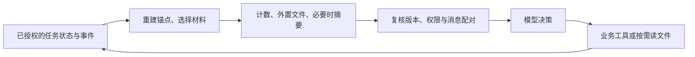

# 第五步：上下文管理

**状态：已按安克全产品售后场景修订（2026-09-12）。** 保留“关键状态重建、长内容外置、摘要与路径常驻、按需读回、任务结束回收”；补充产品、排障反馈与图片上下文。`read_context` 属于第三步的 11 个工具，图片读取由 `inspect_image` 负责。

## 1. 要解决的问题

用户确认了某款 S1 Pro，已尝试两个步骤，又补发图片和购买凭证。堆满手册会挤占窗口，只留最近几轮则可能选错产品、重复失败步骤，甚至把“升级提交结果未知”总结成“故障已解决”。

**原始事件可追溯，临时文件存放长内容，模型窗口只装当前决策需要的部分。** 摘要用于理解历史，最新任务状态用于控制流程；临时文件是可重建的派生副本，不是业务状态的唯一存储。

## 2. 每次给模型看什么

| 内容层 | 选择与保留规则 |
|---|---|
| 稳定前缀 | Harness 规则、当前允许的工具定义、Skill 名称与用途；稳定排序，便于服务商支持时复用前缀缓存 |
| 任务锚点：每步重建 | 目标与紧迫性、已确认产品及版本、TODO、当前步骤和用户反馈、必要购买／工单标识、草案确认与未决操作；保留来源定位 |
| 当前工作材料 | 当前 Skill、型号适用的技术／政策条款、图片观察与证据；正文外置，窗口保留当前片段、摘要、路径及版本 |
| 最近交互 | 最新消息优先；超长消息同样可分片。历史工具调用与对应结果保持配对，大结果可替换为文件引用 |
| 较早历史 | 保留已试步骤与结果、用户顾虑、凭证核验缺项及矛盾；完整记录外置，当前决策涉及的失败步骤优先回填 |

任务锚点从持久状态和用户原文引用重建，不由历史摘要覆盖。约束变更保留出处，旧值标记失效；推断与用户确认分开。长输入尚有未读片段时明确标记，涉及方案条件的片段未核对前不能提出可执行草案。文件内容始终是数据，不能变成系统指令。

TODO 完成不等于步骤已执行；“用户反馈”“模型推断”“工具观察”分开保存。产品改选后移除不适用的手册和步骤；购买记录、质保结论及其缓存重新核对产品关联，旧反馈和记录保留原归属。工单与渠道状态注明观测时间，当前值需要刷新。

**图片按需看，不用文件名代替视觉输入。** 原图按材料保留策略存储；窗口保留材料 ID、观察结果、可读性与产品关联。`inspect_image` 经授权后发送真正的图片给视觉模型，必要时分图／裁剪并保留原图定位；文字摘要不能替代核对小字或故障区域。视觉结果可按图片哈希、观察目的和模型版本缓存，但每次复用仍检查权限，产品变化时重新核对适用性。

## 3. 什么时候压缩，先压什么

可用输入预算 `B = min(应用输入上限, 模型窗口 − 输出预留 − 安全余量)`。文字计数包含规则、工具及协议开销，用所选 tokenizer 与 usage 校准；视觉请求另按服务商图片计费／窗口规则计预算，不能只数 OCR 文字。两类调用均计任务总成本。

首版可设超过 `0.8B` 时收缩，目标降至 `0.6B`，阈值待评测。预留下一次文件读取的空间；最小规则、工具定义、状态字段与一个读取片段必须在模型接入时验证能装下，不能等用户对话中才发现模型窗口不适配。

按顺序执行，空间够用即停止：

1. **长结果先落盘。** 大工具结果到达时就按字段／段落分片，保存不可变文件，窗口放必要字段、文件摘要与路径。同资源同版本去重，原始事件不修改。
2. **卸载无关正文。** 非当前 Skill、候选政策和旧读取片段退出窗口，保留索引；作出当前判断前读回完整相关条款，不能仅凭摘要猜政策例外。
3. **摘要已处理历史。** 先持久化原文，再用无工具权限的模型生成带来源的摘要。只替换已结束交互组；新消息留在尾部。校验格式与引用不等于保证语义正确。
4. **仍超长就进一步外置。** 保留最小任务锚点、当前片段和文件目录入口，其余分片落盘；目录过长也分页。摘要失败则退回程序生成的内容类型、时间、来源、节选与目录，继续按需读取，不因“摘要压不下”终止服务。

例：移出大段手册后，仍须保留“产品 P 已确认；步骤 A 无变化；步骤 B 无法执行；明天要用；升级 op-17 结果未知”。程序先对账，不重复提交或把旧失败步骤重新推荐。

## 4. 文件怎么读，什么时候删

模型看到任务内虚拟路径，例如 `/context/history-003.md`，附“产品 P 的排障反馈，事件 12–28，含未解决问题”。服务端清单映射物理文件，记录产品关联、任务归属、来源区间、哈希和权限版本；路径本身不授予访问权。

新增 **`read_context(path, cursor?, query?)`**：默认读取首片段，`cursor` 翻页，`query` 可选且只做文件内字面关键词定位。扫描量受限，返回来源、片段及续读位置，未扫描完不能声称无匹配。输出取配置上限与窗口可用余量的较小值；游标绑定文件版本和查询，目录也分页。旧读取片段可再次移出窗口。

运行时负责写入、发布和删除，模型只有读取权。每次读取重新核对当前任务与资源权限，拒绝未登记路径、跨任务、路径穿越和符号链接；不新增通用文件编辑或 Shell 工具。原有 TODO 强制规则照常生效，读文件也计工具调用预算。

**生命周期绑定任务，不绑定一次回复或进程：**

- `RUNNING / WAITING / PAUSED` 保留文件，等待确认和跨日恢复不能清理；首版使用任务专属目录及持久卷。
- `COMPLETED / CANCELLED` 且没有未核验操作、运行中调用后，原子标记待清理、拒绝新读取，再幂等删除该任务临时文件；摘要缓存和活动路径引用一并失效。重新打开任务时先取消清理资格或重建文件，再恢复执行。
- 后台回收器补偿崩溃遗留的清理任务，利用现有任务版本与执行占用校验，不能只按文件年龄误删等待任务。文件意外丢失时按仍有权限的原始记录重建；磁盘不可用可直接从原记录分页返回。

删除临时文件不等于删除原始聊天、业务证据和回执，后者按独立保留策略处理。若大正文原本只存文件，它属于原始材料，不能作为临时副本删除。权限撤销同时使文件、摘要与缓存失效；无法精确剔除的混合摘要整份重建。

## 5. 如何接入运行时，保持轻量

一个上下文插件提供 `ContextBuilder`、小型 `ContextArtifactStore` 和 `read_context`，分别负责组装、文件生命周期和受限读取。返回消息、token 估算及来源清单；权限、状态权威性及工具配对仍由内核复核。

PostgreSQL 保存任务、原事件及文件清单，首版通过 pgvector 检索产品技术知识与政策；Redis 缓存可丢弃，具体检索缓存按第七步暂缓。任务临时文件先落本地持久卷，多机部署再换存储适配器。临时文件中的工单和渠道信息是历史观察，需要当前值仍走业务工具。

文件先写完整并校验，再发布引用；失败不能用无效路径替换原文。摘要记录来源区间和版本，发布时检查任务是否变化；出现矛盾回到原文，避免只对摘要反复改写。摘要输入也限长，必要时分片处理。

每次决策前最多一次摘要调用，计任务成本但不重置 TODO 计数。等待任务不为压缩而唤醒，固定确认／对账不依赖摘要。外置解决窗口问题，不取消总执行预算；预算耗尽仍按原运行时保存进度，不能无限读文件。

## 6. 参考什么，怎样证明有效

| 参考 | 本项目借鉴与取舍 |
|---|---|
| [Pi：compaction.ts][pi] | 借鉴预算触发和合法裁剪边界；不照搬字符估算与 coding 场景默认阈值 |
| [Commerce：prompt_assembly.py][commerce-prompt]、[turn.py][commerce-turn] | 借鉴稳定提示前缀、优先清理旧工具观察；本项目保留原始事件，只裁发送给模型的投影 |
| [Deep Agents 上下文管理][deepagents]与[文件中间件][deepagents-code] | 借鉴大内容外置、路径与预览、按需读回；本项目只提供任务内只读工具，文件清理规则由自己的任务状态控制 |
| [ACON 论文][acon-paper]与[代码][acon-code] | 借鉴同时压缩观察和历史、根据压缩导致的任务失败改进保留规则；首版人工分析失败对照，不引入其完整优化与蒸馏流水线 |
| [SUPO，ACL 2026 主会长文][supo]（CCF-A） | 论文联合优化工具使用与摘要策略；这里借鉴“用后续任务表现评价摘要”的思路，不引入 RL 训练，也不宣称复现论文收益 |

用相同起点和可复现模拟环境比较：窗口内完整历史、直接丢最旧消息、本方案。模型从压缩点继续执行，检验后续行为，不只给摘要打语言分。

记录任务成功、约束遗漏和错误执行，以及摘要／读回／视觉总成本与延迟。重点验证：压缩后不选错产品、不忘失败步骤；需要看图时能读取原图；长输入可分片、摘要失败能继续；跨日可恢复、终态清理不误删、跨任务访问拒绝。合成样本明确标记，评测代码不计产品预算。

**本轮修订：临时文件＋摘要／路径＋受限读回＋任务结束回收。** 数值阈值留到选定模型和评测后调整。

[pi]: https://github.com/badlogic/pi-mono/blob/main/packages/coding-agent/src/core/compaction/compaction.ts
[commerce-prompt]: https://github.com/anthropics/commerce-agents/blob/fd4d59224ab96b43c6dc6888207c67b3bd5a24cf/commerce-common/commerce_common/prompt_assembly.py
[commerce-turn]: https://github.com/anthropics/commerce-agents/blob/fd4d59224ab96b43c6dc6888207c67b3bd5a24cf/commerce-common/commerce_common/turn.py
[acon-paper]: https://arxiv.org/abs/2510.00615
[acon-code]: https://github.com/microsoft/acon
[supo]: https://aclanthology.org/2026.acl-long.966/
[deepagents]: https://docs.langchain.com/oss/python/deepagents/context-engineering
[deepagents-code]: https://github.com/langchain-ai/deepagents/blob/main/libs/deepagents/deepagents/middleware/filesystem.py
