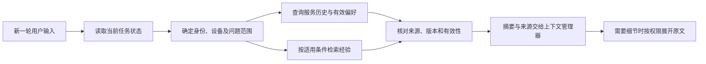

# 第六步：Memory 设计

**状态（2026-09-12）：亮点方向已认可，本文整理具体设计，尚未实现。** 面向安克全产品售后，重点是跨会话接续、有来源的记忆更正，以及按设备和时间判断经验是否适用。

## 1. 问题场景与设计目标

用户昨天为扫地机排障，已经重启、清理滚刷，今天回来继续咨询；同一个账号还拥有另一台同型号设备。如果只检索相似聊天，Agent 可能重复无效操作、串用设备历史，或者沿用过期方案。

我们希望它能说明：“昨天这台设备已试过两步，反馈仍未恢复。先确认今天还是这台，再继续下一步。”每条记忆都能回答：**谁说的、说的是哪台设备、什么时候发生、现在还适不适用。**

| 记忆类型 | 保存内容 | 使用边界 |
|---|---|---|
| 服务事件记忆 | 设备、问题、已试操作、反馈与来源 | 支持跨会话接续；“操作完成”与“故障恢复”分开 |
| 明确偏好 | 用户主动表达的语言、指导节奏等 | 可更正和遗忘；不把一时情绪推断为长期性格 |
| 可复用经验 | 经筛选的故障线索、适用条件和处理结果 | 辅助检索与判断；不能替代当前手册、政策和批准的步骤 |

当前任务状态继续由运行时维护，Memory 不另建一份权威状态；手册与政策仍由 RAG 提供。第五步的临时文件负责本任务内容展开，跨任务记忆单独管理生命周期。

## 2. 写入：从事件提炼，保留事实归属

**事件先保存，记忆随后生成。** 已确认的产品、步骤反馈、工单回执沿用业务事件写入；以事件 ID 幂等生成服务记忆。偏好和经验在本轮交互结束、出现新反馈或任务结束时后台提炼，先检查是否有新事件，避免每一步都调用抽取模型。

模型只能提交结构化候选；写入逻辑校验来源、权限、类型和关联关系。设备不明确的陈述保留为待澄清记录，不绑定到猜测的设备；“用户自述”“工具核验”“模型推断”分别标注，推断不能升级为已确认事实。

**最小记忆记录：** `id/type/content`、`user_id/device_id/problem_id`、`source_event_ids/evidence_kind`、`occurred_at/valid_until`、`version/status/supersedes_id`。经验另带型号、固件及适用前提；不适用的字段允许为空，但缺失条件不能被当作已满足。

去重首先依据来源事件 ID。相似内容只有在设备、问题、时间与结果一致时才合并；“昨天重启无效”和“今天更新后恢复”必须保留为不同事件。后台提交前再次检查来源版本和删除状态，防止用户更正后旧抽取任务又写回错误内容。

## 3. 读取：先确定范围，再决定相关性

1. **先接续确定的任务。** 同任务恢复直接读取运行时状态；跨任务服务历史优先通过用户、设备和问题 ID 查询。相同型号不代表同一台设备，归属不明时先澄清。
2. **再检索经验。** 先过滤权限、有效状态、型号与已知适用条件，再做语义召回；条件未知的经验只提示核实前提，不直接进入排障操作。
3. **按预算装入上下文。** 优先返回已失败步骤、未解决问题、明确偏好及少量相关经验，附来源和时间。长原文经授权读取后外置为当前任务临时文件，继续使用已有 `read_context`。
4. **使用前检查最新版本。** 首版在 PostgreSQL 查询内约束有效状态与权限，返回前核对来源；旧版本、已删除内容不能重新进入模型窗口。以后增加外部索引或缓存时，仍需回查可信状态。

记忆可以帮助组织追问、避免无意义重复、选择知识检索方向；重试历史失败步骤需要当前规程或新条件支持。质保结论仍重新查业务系统，物理操作仍走受控工具，历史“已恢复”不能自动关闭当前任务。

## 4. 更正、遗忘与经验复用：亮点如何落地

**更正有来源。** 用户说“昨天清理的是另一台”，记录更正事件，撤销错误关联并使对应派生摘要失效；不把原始记录悄悄改成另一段话。不同时间的结果可以并存；同一事实发生矛盾时保留争议并澄清，不能只凭最后一句自动覆盖已核验记录。

**失效可传播。** 首版在 PostgreSQL 同一事务内更新记忆及其向量记录的状态／版本，读取立即排除失效内容；随后清理已生成的上下文副本，清理失败可以重试。暂不缓存记忆检索结果，减少失效路径；已送入模型的旧上下文无法撤回，若调用期间发生更正，旧结果在回复或执行前作废并重建。

**生命周期分开。** “明天急用”转为带日期的任务约束，到期退出当前建议；稳定偏好保留至更正、遗忘或账号保留策略触发。服务事件按业务记录策略保留。临时上下文仍按第五步在任务生命周期结束后回收；用户要求遗忘时同时阻止后台从旧来源重新提炼，业务留档与可用于记忆的范围分开处理。

**经验经过筛选。** 首版由维护者从有明确结果的工单中确认可复用条目，记录前提、来源和知识版本。个人服务历史默认只用于本人；跨用户经验须去除身份、凭证等个人内容，并单独授权发布。失败或过期经验可退出推荐，原始业务记录保持可追溯。

记录经验被哪些任务使用及后续反馈，供离线评估和撤回；一次失败不自动证明该经验无效。首版不让 Agent 自行改写 Skill、安全规则或排障规程。

## 5. 轻量实现与运行时衔接

| 位置 | 实现职责与理由 |
|---|---|
| Memory 插件 | 沿用启动装配；内部只提供写入、召回、失效三类操作，把存储与主循环解耦 |
| PostgreSQL | 复用事件表，增加记忆及来源关联记录；负责版本、状态和幂等，便于事务内更正 |
| pgvector | 与知识检索共用 PostgreSQL 扩展，只用于需要语义匹配的经验；记忆与知识通过独立记录和权限隔离 |
| Redis | 复用后台任务唤醒；首版不缓存记忆检索结果 |
| 现有工具／上下文管理器 | `get_service_history` 展开受权历史，Memory 召回结果进入上下文组装；保持现有 11 个工具边界 |

新事件提交后，由现有后台任务机制幂等提炼；待处理记录落在 PostgreSQL，Redis 丢失唤醒时可补扫。下一轮读取时，先用最新业务状态，再补充已生成的记忆。

**失败时继续服务：** 抽取失败保留事件并延后重试；Redis 唤醒失败由原有任务补扫接续；embedding 不可用时继续查询结构化历史，停止语义经验推荐。PostgreSQL 不可用时不能假设仍能查询历史；无法核验权限或版本的记忆不展示，可以解释暂时故障并澄清，不能基于失效材料执行操作。

## 6. 验收：证明记忆改善了服务

对照“无跨任务记忆”“预算内完整历史”“朴素向量检索”与本方案，固定模型、知识库和读取预算，按事件时间切分，避免提前看到未来反馈。

| 必测场景 | 判断标准 |
|---|---|
| 隔天继续同一故障 | 正确保留步骤及反馈，减少无依据的重复引导 |
| 同账号切换同型号设备 | 不串用排障、购买和恢复记录 |
| 用户更正或遗忘，后台抽取仍在运行 | 旧记忆不再召回、不被重建，派生副本最终完成清理 |
| 时间约束到期、经验条件不匹配 | 不沿用过期紧迫性，不把相似经验直接变成操作 |
| 检索或抽取故障 | 可以基于有效任务状态继续服务，不伪造历史 |

记录接续准确率、错误经验复用率、失效内容残留率和任务完成率；成本统计包含抽取、embedding、读取及摘要的总 Token 与延迟。分别去掉来源校验、适用条件过滤、分层读取做消融，验证各部分是否值得保留。

## 7. 参考：只保留设计映射

| 来源 | 本项目吸收的思想 |
|---|---|
| [LangMem](https://github.com/langchain-ai/langmem/blob/main/src/langmem/knowledge/extraction.py)／[Mem0](https://github.com/mem0ai/mem0/blob/main/mem0/memory/main.py) | 区分同步事件与后台提炼；抽取时参考旧记忆，控制重复增长 |
| [OpenViking](https://docs.openviking.ai/en/concepts/03-context-layers)／[Hindsight](https://hindsight.vectorize.io/developer/observations) | 摘要分层与按需展开；派生结论保留来源，并随来源变更失效 |
| [A-Mem，NeurIPS 2025](https://proceedings.neurips.cc/paper_files/paper/2025/hash/19909c36f51abc4856b4560aff3d36d6-Abstract-Conference.html) | 小粒度记忆及关联；首版用来源 ID，暂不引入自动记忆图 |
| [RMM，ACL 2025](https://aclanthology.org/2025.acl-long.413/) | 按话题组织记忆；迁移为“设备＋问题”，暂不训练检索器 |
| [Experience-Following，ACL 2026](https://aclanthology.org/2026.acl-long.27/) | 历史成功也可能误导；经验进入和退出检索都要有依据 |
| [LongMemEval](https://github.com/xiaowu0162/LongMemEval) | 借用时间推理、知识更新和拒答维度，补充售后流程评测 |

以上三篇 NeurIPS／ACL 论文为 CCF-A 会议主会论文；LongMemEval 作为补充基准。来源核对日期为 2026-09-12；借鉴机制不等于引入整套框架，售后效果以本项目评测为准。

