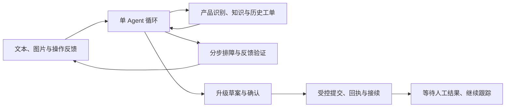

# 客服 Agent Harness 项目方案

## 第一步：问题场景和项目架构

**状态（2026-09-14）：安克全产品售后 Harness 的第 1～13 步首版设计已补齐，尚未实现应用。** 本文为问题场景与整体架构；完整导航见 [README](README.md)，开始实现见[第十三步](design/第十三步-实施路线与交付验收.md)。保持原文件名，便于查阅。

设计分三组：运行时与能力边界（第 2～6 步）、知识／评测／模型（第 7～9 步）、后端／前端／部署／实施（第 10～13 步）。各模块只保留本模块实现决策，不在本文重复展开。

**继续保留的目标：** 求职项目、轻量代码、可部署后端、插件化 Harness、强制 TODO、受控执行和证据追溯。RAG 展示知识面，Redis 服务既有后台需求；首版优先实现需求，Milvus 可在后续引入。设计持续用 ponytail 检查过度设计；功能测试与效果评测代码不计产品代码预算。技术参考不限于 Commerce Agents 和 DSH，具体选型仍须说明问题、理由与代价。

**共用机制：** 11 个工具、3 份通用 Skill；强制 TODO、受控工单提交和持久恢复。长上下文外置临时文件并按需读回，任务结束后回收；图像按材料 ID 实际读取，不能用图片摘要代替视觉核对。

### 1. 新场景：安克全产品统一售后，从求助到解决与接续

> “我的 S1 Pro 不吸了，明天就要用。”用户又发来一张含糊的故障照片。

目标链路变为：理解诉求与紧迫程度 → 确认产品 → 结合图片、技术知识与历史工单定位问题 → 分步引导并接收反馈 → 验证恢复，或携带证据升级。订单查不到时进入凭证／渠道核验，不能直接推断不享有质保。

**产品范围已明确：** 面向安克全公司所售产品提供统一入口，产品消歧是服务链路中的必要能力。通过产品目录确认身份，加载对应手册、知识与政策，所有产品复用接待、排障、核验和升级机制；不能把某类产品预先设成“只能转接”。自动处理还是升级，由当前证据、规则和处理结果决定。

**实现取舍：** 控制代码体量靠共享机制与数据驱动的产品差异。演示案例和评测样本可选代表性问题，但不把样本范围当成产品服务边界。当前目录仅发现原欧莱雅材料，新产品知识覆盖率需要单独记录，不能声称已经具备全量资料或所有故障的解决能力。

**背景依据：** [赛事官网](https://career.anker.com.cn/hackathon/)列明第四赛道为“智能服务”；具体任务以用户提供的赛题原文及“全公司所售产品”的范围澄清为准。

**完成标准：** 恢复需绑定当前产品／步骤的明确反馈或核验结果；升级需工单回执和接续材料。工单受理后显示“未解决、已升级”并等待人工结果，不能把受理当修复。情绪影响追问和引导节奏；产品身份、图片判断、质保依据不足时保留不确定性。

**文档归属：** 当前 Harness 设计统一位于本仓库。旧人工辅助黑客松方案、执行说明、启动提示词与赛事数据审计位于工作区 `archive/loreal/`；Commerce 学习指南位于工作区 `reference/Commerce-Agents中文学习指南.md`。这些仓库外资料不作为当前实施入口，所需上游依据已在各设计文档中链接。

### 2. 两个参考项目，各解决一个架构问题

**DSH 帮助组织能力：** 模型、上下文、工具与存储通过接口装配，宿主负责依赖和生命周期。我们借鉴插件思想，首版只做启动装配，使用随项目发布的受信插件。[D1]

**Commerce Agents 帮助约束业务行为：** 保留一个 Agent 循环，通过业务接口读写外部系统，把关键检查放在执行路径。下面三条原则落到现有代码职责中，不新增架构层级。

| 借鉴原则 | 在售后场景中解决什么 | 如何轻量落地 |
|---|---|---|
| **运行框架与业务实现分开** [C1] | 接入更多产品时，避免复制一套 Agent | 共享售后工具与运行时，产品目录、技术知识和政策承载差异；只有业务接口或执行能力确有差异才增加适配器 |
| **关键事实由后端提供，模型引用有来源的对象** [C2] | 选错产品、引用错版本手册或编造工单状态 | 产品与工单引用已查得的 ID，检索返回适用型号及版本；图片推断与已核验事实分开 |
| **先形成草案，再确认执行，执行时重新检查** [C3] | 升级工单内容与用户确认内容不一致，或重复提交 | 复用动作记录与确认回执机制；读知识和普通排障指导不机械套用写入审批流程 |

“查询过这个 ID”只说明有来源，不能代替归属授权；政策引用也不能代替业务资格检查。服务端补齐关键字段减少事实错误，但自由文本回复仍需评估。

Commerce Agents 的依据是参考实现、示例与测试。其 README 明确不会真实下单或扣款，因此这里不声称它已替我们验证了生产售后流程。[C4]

### 3. 当前推荐的行为边界

**模型自主选择必要的查询、追问和解释；改变业务状态的操作经过固定校验。**

这样既能处理不同用户表达，也能让工程代码约束身份、确认、业务条件和执行结果。DSH 的插件化允许替换能力；Commerce Agents 的执行思想让替换后的能力继续遵守相同业务约定。

图表示共享业务链路，每个方框不对应一个服务或 Agent。型号资料决定可用步骤，已试步骤和用户反馈决定如何继续；具体契约已同步到第二、三步。

**前端形成操作闭环：** 消费者侧提供对话、图片上传、产品确认、逐步操作反馈、凭证补充和工单进度；人工侧用简洁任务页接收证据与未解决事项。卡片对应真实事件和状态，恢复会话后沿用进度。

**保留的失败演示：** 后端已创建升级工单，响应却丢失。恢复后按动作标识核验，避免重复创建。新增场景验收将重点检查产品消歧、排障反馈和未解决问题的移交。

### 4. 后端技术栈的暂定职责

| 组件 | 为什么在这里使用 |
|---|---|
| Python + FastAPI | 集中实现模型接入、接口与后台任务；API 和 Worker 共用工程，避免提前拆微服务 |
| React + TypeScript + Vite | 消费者操作卡与人工接续复用同一事件契约；静态构建，不另起 Node 后端 |
| PostgreSQL | 保存任务、动作、确认与回执，支持恢复和并发校验 |
| Redis | 后台任务唤醒、限流及短期缓存；关键任务状态仍在 PostgreSQL |
| pgvector + RAG | 复用 PostgreSQL 检索型号适用的技术知识与政策，保留过滤、来源与版本 |
| Docker Compose | 支持本地复现与单机上线，先不引入 Kubernetes |

首版选择 PostgreSQL + pgvector，减少一个独立检索服务；先实现精确线索查询、语义检索和证据闭环。混合检索、独立重排、检索缓存与 Milvus 迁移都按评测或后续明确需求增加，不提前写多套适配器。[V1] 上线资源以实测为准，具体取舍见第七步。

### 5. 怎样体现思考，同时控制体量

首版围绕**一个共享 Harness、全产品知识接入、通用售后链路与受控升级**实现闭环，继续使用已讨论的自写有界循环。无需每个品牌或产品配一个 Agent；产品差异优先通过资料与规则表达，插件用于实际能力差异。

先验证“识别对产品、给出适用步骤、根据反馈继续或升级”，再测图片与检索依据、恢复能力和成本。真实硬件效果与模拟测试结果分开呈现。

暂不加入多 Agent 复核、插件市场、动态热更新、复杂风险大屏或新的 RL 训练。产品实现代码以数千行为范围目标；**功能测试、效果评测、基准实验及评测辅助代码不计入该预算**，不为限制行数削弱验证。

### 6. 实现边界与验证

模型自主选择澄清、查询、观察和有依据的排障步骤，用户执行并反馈；程序检查步骤适用性与安全条件，固定执行已确认的升级草案。经销商核验缺项进入待核验／人工审查，不因内部订单缺失拒保。未接入真实工单系统时使用明确标注的模拟后端。

第 1～13 步已明确知识入库、数据建设、API、前端、部署与验收的首版设计；后续进入代码和资料实施。评测分别报告产品消歧、视觉观察、知识适用、排障解决、有效移交、恢复和总成本，不声称已获得实测收益。

### 参考定位

- [D1：DSH 架构](https://github.com/deepseek-ai/deepseek-harness/blob/5dda764ed3aa172535a7967b06ff95d9cbfe536a/docs/architecture.md)：借鉴插件装配、能力接口与生命周期。
- [C1：Commerce Agents Backend 指南](https://github.com/anthropics/commerce-agents/blob/fd4d59224ab96b43c6dc6888207c67b3bd5a24cf/docs/backends.md)：借鉴会话绑定身份、业务接口与流程前置条件。
- [C2：服务端展示数据补齐](https://github.com/anthropics/commerce-agents/blob/fd4d59224ab96b43c6dc6888207c67b3bd5a24cf/shopping-agent/core/shopping_agent/enrichment.py)：借鉴按已知 ID 取规范记录，拒绝无来源对象。
- [C3：商家执行检查](https://github.com/anthropics/commerce-agents/blob/fd4d59224ab96b43c6dc6888207c67b3bd5a24cf/merchant-agent/core/merchant_agent/gates.py)：借鉴草案来源、宿主批准及执行时重新检查；[对应测试](https://github.com/anthropics/commerce-agents/blob/fd4d59224ab96b43c6dc6888207c67b3bd5a24cf/merchant-agent/core/tests/test_changes.py)包含使用当前规则重新校验的用例，本轮仅阅读、未执行。
- [C4：仓库范围说明](https://github.com/anthropics/commerce-agents/blob/fd4d59224ab96b43c6dc6888207c67b3bd5a24cf/README.md)：用于核对真实下单与商用验证的边界。
- V1：[Milvus 混合检索](https://milvus.io/docs/multi-vector-search.md)、[pgvector](https://github.com/pgvector/pgvector)、[Qdrant 混合检索](https://qdrant.tech/documentation/search/hybrid-queries/)；此处仅保留选择理由，细节在检索设计时讨论。
