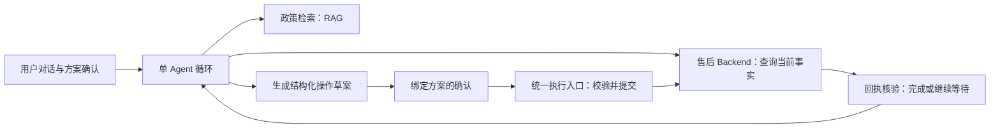

# 客服 Agent Harness 项目方案

## 第一步：问题场景和项目架构

**状态：架构、运行时、9 个工具与 2 份 Skill（含强制 TODO）、权限边界均已认可。** 已讨论：[第二步：运行时](design/第二步-Agent主逻辑与运行时.md)、[第三步：工具与 Skill](design/第三步-工具与Skill.md)、[第四步：权限边界](design/第四步-权限与安全边界.md)；当前讨论 [第五步：上下文管理](design/第五步-上下文管理.md)。各步独立成短文。

**后续实现约定：** 按已讨论的工具、Skill 与 TODO 机制实现；技术参考不限于 Commerce Agents 和 DSH，按具体问题选择其他优秀 GitHub 实现及 CCF-A 论文，说明借鉴部分、适用条件与代价，不为引用而增加组件。

**第五步修订方向：** 超长上下文落任务临时文件，保留摘要与路径，补充受限 `read_context` 工具按需读回；任务生命周期结束后回收，不因普通上下文超长暂停。

### 1. 项目要解决什么问题

> “粉底液泵头坏了，能换同色号吗？这周要用。”

面向一个模拟商家、一个渠道，完成同 SKU 的质量问题换货／补发：查询订单与政策 → 补齐必要信息 → 提出方案 → 取得确认 → 提交申请 → 核验回执，必要时等待并恢复任务。

难点是把用户诉求变成有依据、可执行、结果可核验的操作。提交申请和收到替换商品是不同目标，不能统一用“办好了”表示完成。

**求职定位：** 已有 coding agent + Agent-RL 项目，这个项目补齐业务 Agent、后端服务和 RAG 工程能力。RAG 是必要的知识能力；主要展示点暂定为插件设计与可靠执行。首版不覆盖真实支付、跨 SKU 换货或完整电商平台。

### 2. 两个参考项目，各解决一个架构问题

**DSH 帮助组织能力：** 模型、上下文、工具与存储通过接口装配，宿主负责依赖和生命周期。我们借鉴插件思想，首版只做启动装配，使用随项目发布的受信插件。[D1]

**Commerce Agents 帮助约束业务行为：** 保留一个 Agent 循环，通过业务接口读写外部系统，把关键检查放在执行路径。下面三条原则落到现有代码职责中，不新增架构层级。

| 借鉴原则 | 在售后场景中解决什么 | 如何轻量落地 |
|---|---|---|
| **运行框架与业务实现分开** [C1] | 换订单系统或模型时，避免改动整个 Agent | 一个售后 Backend 接口承接订单、库存和申请；美妆字段与业务条件留在该实现中，插件内核不理解“色号” |
| **关键事实由后端提供，模型引用有来源的对象** [C2] | 模型拿错订单、编造状态，或展示不存在的 SKU | 模型引用已查得的 ID；服务端校验归属并补齐卡片字段。RAG 返回政策来源与版本，订单工具返回当前事实 |
| **先形成草案，再确认执行，执行时重新检查** [C3] | 用户确认的方案与实际操作不一致，或确认后库存发生变化 | 一份持久化动作记录保存参数、确认与回执；确认绑定具体方案，提交时检查当前条件，不另建审批平台 |

“查询过这个 ID”只说明有来源，不能代替归属授权；政策引用也不能代替业务资格检查。服务端补齐关键字段减少事实错误，但自由文本回复仍需评估。

Commerce Agents 的依据是参考实现、示例与测试。其 README 明确不会真实下单或扣款，因此这里不声称它已替我们验证了生产售后流程。[C4]

### 3. 当前推荐的行为边界

**模型自主选择必要的查询、追问和解释；改变业务状态的操作经过固定校验。**

这样既能处理不同用户表达，也能让工程代码约束身份、确认、业务条件和执行结果。DSH 的插件化允许替换能力；Commerce Agents 的执行思想让替换后的能力继续遵守相同业务约定。

图表示业务与架构边界，每个方框不对应一个服务或一个 Agent。内部接口、循环实现与状态表尚未定稿。

**一个失败案例贯穿开发和演示：** 后端已经创建补发单，响应却丢失。系统将结果记为待核验，恢复后按动作标识查回执，避免重复创建。幂等标识与业务结果也放进上述动作记录，不另造一套恢复账本。这是本项目在参考思想上的实现要求，不能算作仓库已经提供的能力。

### 4. 后端技术栈的暂定职责

| 组件 | 为什么在这里使用 |
|---|---|
| Python + FastAPI | 集中实现模型接入、接口与后台任务；API 和 Worker 共用工程，避免提前拆微服务 |
| PostgreSQL | 保存任务、动作、确认与回执，支持恢复和并发校验 |
| Redis | 后台任务唤醒、限流及短期缓存；关键任务状态仍在 PostgreSQL |
| Milvus + RAG | 检索适用政策，练习独立检索服务的索引、过滤和更新 |
| Docker Compose | 支持本地复现与单机上线，先不引入 Kubernetes |

Milvus 是结合学习目标作出的候选选择：本项目的小规模数据用 pgvector 同样合理，且能减少一个服务；Qdrant 也有混合检索能力。我们选择 Milvus 来实践独立检索服务，接受其额外部署成本，不宣称它必然更快、更准。[V1] 上线资源预算尚待确定，不能把代码轻量等同于基础设施零成本。

### 5. 怎样体现思考，同时控制体量

首版围绕**一个 Agent、一个业务场景、一套业务接口、一份动作记录**实现闭环。插件只为职责隔离和实际替换而设；普通函数、提示词和前端组件无需全部插件化。具体采用自写循环还是成熟框架，仍待后续比较。

验收先看两个结果：正常情况下按确认方案完成申请；超时并重启后仍只有一张有效申请。再测政策依据、任务成功率和成本，不以工具数量作为完成度。

暂不加入多 Agent 复核、插件市场、动态热更新、复杂风险大屏或新的 RL 训练。产品实现代码以数千行为范围目标；**功能测试、效果评测、基准实验及评测辅助代码不计入该预算**，不为限制行数削弱验证。

### 6. 已确认的取舍与下一步

**已确认：模型自主选择查询和追问，业务写入经过固定校验。** 下一步讨论 Agent 主逻辑：如何推进一轮、如何等待、如何在失败后恢复。循环具体实现仍是待讨论方案。

### 参考定位

- [D1：DSH 架构](https://github.com/deepseek-ai/deepseek-harness/blob/5dda764ed3aa172535a7967b06ff95d9cbfe536a/docs/architecture.md)：借鉴插件装配、能力接口与生命周期。
- [C1：Commerce Agents Backend 指南](https://github.com/anthropics/commerce-agents/blob/fd4d59224ab96b43c6dc6888207c67b3bd5a24cf/docs/backends.md)：借鉴会话绑定身份、业务接口与流程前置条件。
- [C2：服务端展示数据补齐](https://github.com/anthropics/commerce-agents/blob/fd4d59224ab96b43c6dc6888207c67b3bd5a24cf/shopping-agent/core/shopping_agent/enrichment.py)：借鉴按已知 ID 取规范记录，拒绝无来源对象。
- [C3：商家执行检查](https://github.com/anthropics/commerce-agents/blob/fd4d59224ab96b43c6dc6888207c67b3bd5a24cf/merchant-agent/core/merchant_agent/gates.py)：借鉴草案来源、宿主批准及执行时重新检查；[对应测试](https://github.com/anthropics/commerce-agents/blob/fd4d59224ab96b43c6dc6888207c67b3bd5a24cf/merchant-agent/core/tests/test_changes.py)包含使用当前规则重新校验的用例，本轮仅阅读、未执行。
- [C4：仓库范围说明](https://github.com/anthropics/commerce-agents/blob/fd4d59224ab96b43c6dc6888207c67b3bd5a24cf/README.md)：用于核对真实下单与商用验证的边界。
- V1：[Milvus 混合检索](https://milvus.io/docs/multi-vector-search.md)、[pgvector](https://github.com/pgvector/pgvector)、[Qdrant 混合检索](https://qdrant.tech/documentation/search/hybrid-queries/)；此处仅保留选择理由，细节在检索设计时讨论。
