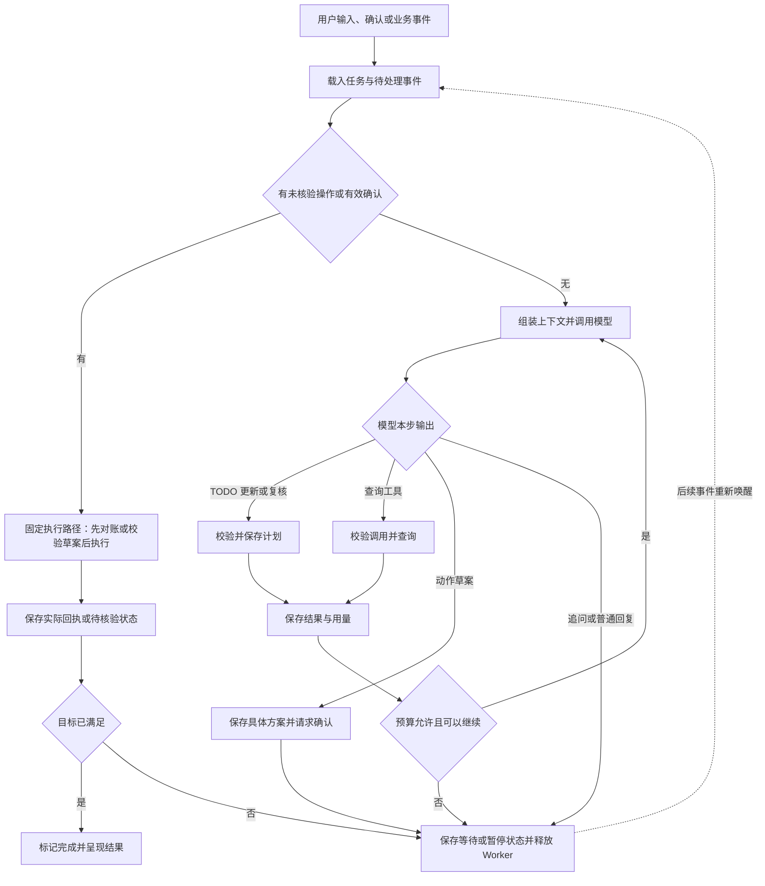

# 第二步：Agent 主逻辑与运行时

**状态：方案方向已认可。** 采用自写有界循环，确认后的固定草案由程序直接执行；下一步见 [工具与 Skill](第三步-工具与Skill.md)。功能测试、效果评测及其辅助代码不计入产品代码预算。

## 1. 推荐：事件唤醒任务，任务内运行有界工具循环

一个换货任务可能持续几天，但一次模型处理通常只有几步。推荐用持久状态跨越等待，用小型 Python 循环完成当前可以推进的工作；等待时保存状态并释放 Worker。

| 概念 | 本项目中的含义 |
|---|---|
| Task（任务） | 一次明确的售后目标，跨对话、确认和业务事件存在 |
| Turn（一轮） | 一次唤醒后的连续处理，到回复、等待、暂停或完成时结束 |
| Step（决策步） | 一次模型请求及其工具结果；网络重试是同一步的 attempt，仍计成本 |

**本轮结束不等于任务完成。** 模型停止调用工具只结束这一轮；完成任务需要业务结果满足目标。确认事件可以直接推进执行，因此一轮也可以没有模型调用。这是本项目的术语约定，不要求与每个参考项目的命名完全相同。

## 2. 一轮具体怎样运行

入口可收敛为 `run_turn(task_id)`，模型、上下文、工具执行与存储通过插件接口提供：

1. **恢复与认领。** 读取待处理事件和任务版本。同任务仅一个执行者；若发现未核验的写操作，先查回执再决定后续，不能重新从用户原话启动。
2. **处理确定性事件。** 有效的方案确认绑定草案版本，由程序直接检查并执行；业务回执更新动作状态。普通输入进入模型循环。
3. **检查计划并构建上下文。** 保留目标、当前 TODO、最近对话和相关事实证据。尚无计划、用户目标变化，或累计 3 个模型决策步没有成功调用 TODO 时，本次请求只允许 `todo`；成功后恢复普通工具。其余调用即便由模型输出也不执行。保留规范的工具调用／结果配对，不把整个事件库塞进模型。
4. **调用模型并接收完整决策。** 文本可以流式展示；工具参数必须完整、通过结构校验后才执行。截断或损坏的工具调用不执行，返回明确错误供模型在预算内修正。
5. **执行并反馈。** 查询工具返回新证据后继续下一步；生成草案则落库并进入等待确认；追问或普通回复结束这一轮。模型仅能提出动作草案，不能自行设置“已批准”。
6. **提交进度。** 保存已完成步骤、等待原因和用量。检查新输入是否已到达，再决定继续还是释放 Worker；有业务回执时按目标校验是否完成。

首版工具按顺序执行，避免同一模型响应中多个调用争用状态。进入等待后，剩余调用记为未执行并补齐对应结果。独立只读查询的并行化留到有时延证据时再加；执行结果可由固定回执卡展示，必要时再调用模型解释。

## 3. 三种工具结果，三种处理方式

| 结果 | 例子 | 循环处理 |
|---|---|---|
| 有效观察／业务阻断 | 查询成功、无库存、缺少确认 | 作为结构化结果反馈；需要用户输入时等待，不当作系统故障重试 |
| 确定失败 | 参数非法；只读接口暂时不可用 | 参数问题让模型修正；临时网络失败可有限重试，均计入预算 |
| 执行结果未知 | 写接口超时、提交后进程崩溃 | 暂停新写入，按同一操作号对账；禁止盲目重发 |

首版拟设每轮最多 **8 个模型决策步、16 次工具调用**，临时网络错误最多额外重试一次；调用超时、token 额度和任务累计预算可配置。它们是起始配置，需通过评测调整。额度不足进入暂停并说明原因，重复通知不能重置预算。

TODO 强制请求在模型适配器支持时使用指定工具的 `tool_choice`；否则只暴露 TODO 并在执行器拒绝其他输出，不能降为一句提示词提醒。成功核对才清零计数；失败最多纠正一次，仍失败或预算耗尽则暂停。所有规划调用都计入上述预算；不为检查计划唤醒等待任务，也不阻塞固定确认执行与未决操作对账。详细契约见第三步。

## 4. 等待和恢复靠什么

只需保存三类信息：**任务快照**（目标、TODO 及版本、未复核步数、状态与预算）、**事件／步骤记录**（输入、模型决策、工具调用及结果）、**动作记录**（草案参数、确认、稳定操作号及回执）。PostgreSQL 是依据，Redis 负责唤醒；模型请求不占用长期数据库事务。

| 情况 | 明确的恢复规则 |
|---|---|
| 等待用户／确认／履约 | 保存 `WAITING` 与具体原因，释放 Worker；收到相关事件后恢复 |
| 写操作开始前 | 先保存执行意图与操作号，再请求业务端；新工具调用 ID 不代表新的业务动作 |
| 写入后丢失回执 | 恢复后按操作号核验；查不到且业务端不能可靠去重时继续暂停，不能保证“恰好一次” |
| 用户处理中改口 | 输入先排队；下一安全边界读取，提交前检查方案是否失效；已发出的操作先对账，不能当作从未发生 |
| 浏览器断开／用户点击停止 | 断开只停止订阅；显式停止阻止后续步骤。已发出的写操作仍需核验，停止模型不等于撤销业务 |

运行状态可限定为 `READY / RUNNING / WAITING / PAUSED / COMPLETED / CANCELLED`，原因单独记录。结果未知属于动作状态；有未核验动作时不能标记任务完成或已取消。

同任务串行依靠任务拥有者／版本校验，首版一个 Worker 进程、不同任务可并发。事件先持久化再通知；进入等待与确认没有新输入要做原子校验，恢复扫描补回丢失的通知。将来增加多个 Worker 时仍需防止旧执行者覆盖状态，Redis 锁本身不能保证业务不重复。

## 5. 从开源项目借鉴什么，为什么这样取舍

| 项目与核查位置 | 借鉴部分 | 在本项目中的取舍 |
|---|---|---|
| [Pi：agent-loop.ts][pi]，`runLoop`、`streamAssistantResponse` | 小型模型／工具循环，调用模型前转换上下文，在安全边界接收新输入 | 保留简洁循环与上下文接口；跨进程恢复由本项目补充，不能把 Pi 的内存循环直接叫持久工作流 |
| [DSH：Architecture][dsh]，Turn flow、Events | step／turn 分工，inbox 输入，持久事件与进程内事件分离 | 确认和业务回执成为唤醒事件；循环作为插件，不增加多个控制 Agent |
| [Commerce Agents：orchestrator.py][commerce]，`stream_turn`；[turn.py][turn] | 有界迭代、工具结果配对、用量累计，截断与异常的善后 | 保留这些约束；首版等待完整模型响应再执行工具，不复制其流式提前派发和部分 UI 渲染复杂度 |
| [LangGraph：持久化][lg-state]与[Interrupts][lg-interrupt] | 保存进度后暂停、按同一任务恢复；中断恢复可能重跑节点，副作用需要单独处理 | 借鉴恢复语义；不将 checkpoint 当作业务接口幂等保证 |

**推荐先自写这一个有界循环。** 主要原因是流程只有查询、草案、确认执行三类推进，且业务动作记录仍需自己管理，直接实现便于展示设计与调试。LangGraph 同样能做轻量方案，并不天然复杂；若后续出现大量分支和子工作流，再考虑由它承担循环插件，避免同时维护两套运行状态机。自写的代价是必须自己验证崩溃窗口和消息竞态。

## 6. 用少量关键案例检验设计

验收覆盖：正常换货闭环；模型持续调用工具直到预算耗尽；确认旧草案被拒绝；提交成功后丢失响应并重启；等待边界收到新消息；截断工具参数未触发操作。比较任务完成、错误动作和恢复结果，评测代码可独立充分实现。

**本轮结论：按自写有界循环推进，确认后的写操作由程序直接执行固定草案。** 具体预算参数和并发实现仍需实现时验证。

[pi]: https://github.com/badlogic/pi-mono/blob/main/packages/agent/src/agent-loop.ts
[dsh]: https://github.com/deepseek-ai/deepseek-harness/blob/5dda764ed3aa172535a7967b06ff95d9cbfe536a/docs/architecture.md
[commerce]: https://github.com/anthropics/commerce-agents/blob/fd4d59224ab96b43c6dc6888207c67b3bd5a24cf/shopping-agent/runtime-messages-api/shopping_agent_runtime/orchestrator.py
[turn]: https://github.com/anthropics/commerce-agents/blob/fd4d59224ab96b43c6dc6888207c67b3bd5a24cf/commerce-common/commerce_common/turn.py
[lg-state]: https://docs.langchain.com/oss/python/langgraph/persistence
[lg-interrupt]: https://docs.langchain.com/oss/python/langgraph/interrupts

资料核查于 2026-09-09；Pi 为当时主分支，正式实现时再固定提交。以上是设计及源码／文档阅读结论，未声称已完成实现或性能验证。
